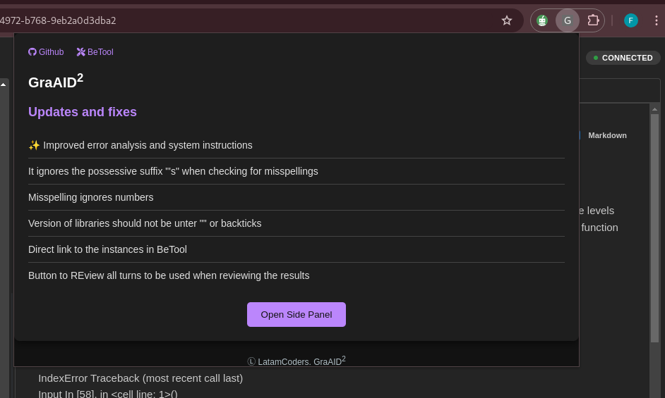
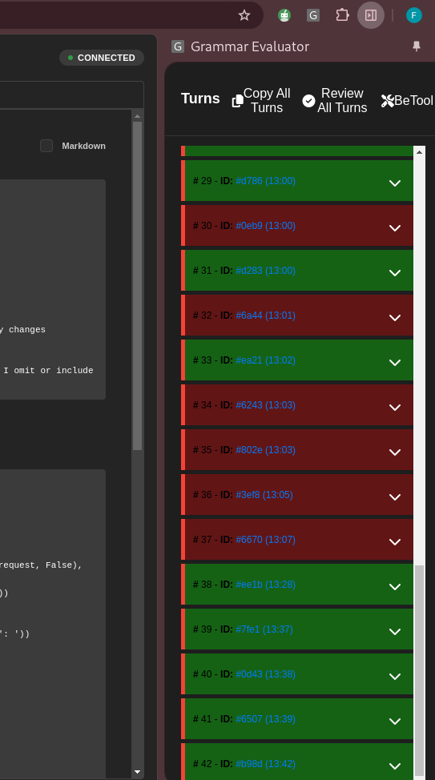
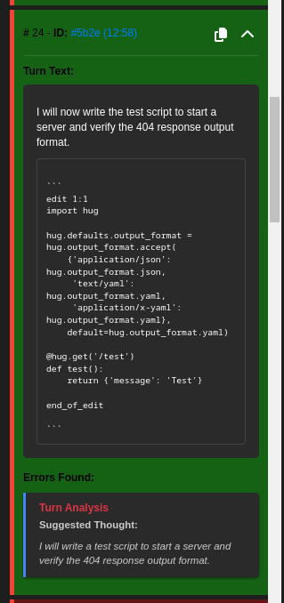

## GrAID<sup>2</sup> Documentation


### Introduction
This tool is an extension for Google Chrome that allows users to perform a grammar check for their trajectories in the AI DEBUGGER.
It works with two checker. A Regex  and with an Gemini API. The current URL is: [GraAID<sup>2</sup>](https://github.com/AlPatinoComSol/GraChAID).

### How to set up the tool

1. Download latest .zip file from the [GrAID<sup>2</sup> GitHub repository](https://github.com/AlPatinoComSol/GraChAID).
2. Unzip the file.
3. Open Google Chrome and go to the extensions page (chrome://extensions/).
4. Activate the "Developer mode" in the top right corner.
5. Load the extension.
    5.1 Click on the "Load unpacked" button.
    5.2 Select the unzipped folder.
    5.3 The extension will be installed and you will be able to use it.

### How to set up the API key

It is very likely that the personal use of the API key falls under the FREE TIER. You have up to 15 req per minutte and 1,000,000 tokens per day in Free tier, it should be enough. But if you exceede this amount of requests or tokens you will be charged a minimum amount. For example for the constant usage of 5 active contributors I was charged for 3 USD in one week.

1. Go to the [GEMINI API](https://aistudio.google.com/app/apikey) page.
2. Click on the "Create API key" button.
3. Select a project.
    * 3.1. If you don't have a project, go to [Google Cloud Console](https://console.cloud.google.com/).
    * 3.2. In the top there is a search bar, write "Create a project".
    * 3.3. Fill the form and click on the "Create" button.
    * 3.4. Once the project is created, it should be listed in the "Projects" section of the [GEMINI API](https://aistudio.google.com/app/apikey) page (you might need to refresh the page).
4. Generate the API key.
5. Copy the API key.
6. Paste the API key in the .env file on the `GEMINI_API_KEY` field.
7. Open the file `dist/bundle.js` and search for `GoogleGenerativeAI(`, it should look like this:
    ```javascript
    var genAI = new _google_generative_ai__WEBPACK_IMPORTED_MODULE_1__.GoogleGenerativeAI("GEMINI_API_KEY");
    ```
8. Replace the `GEMINI_API_KEY` with your API key.
9. Reload the extension.
    * 9.1 Go to the extensions page (chrome://extensions/).
    * 9.2 Click on the "Reload" button.
    * 9.3 The extension will be installed and you will be able to use it.

### How to use the tool
Once you have installed the extension, you can use it by clicking on the extension icon in the Chrome toolbar.


A Popup will appear. On the top left corner you will find a **Github** button that will take you to the [Github repository](https://github.com/AlPatinoComSol/GraChAID) and a **BeTool** button that will take you to the [BeTool](https://indirectly-glowing-cougar.ngrok-free.app/). A list of the most recent updates, and at the bottom you will fin a button to the Side Panel

Once you click on the **Side Panel** button, a side pannel will appear on the right side of the screen.


On the to you will fing 3 buttons:
- **Copy All Turns**: This button will copy all the turns (Tought and Action) of the trajectory to the clipboard.
- **Review All Turns**: This button will review all the turns of the trajectory(preferable  use this buttonwhen you are reviewing a trajectory).
- **BeTool**: This button will take you to the [Beto'sTool](https://indirectly-glowing-cougar.ngrok-free.app/) and search for the current instance.

Below the buttons of the side panel, a list of turns will appear when you click on "next" while working on a trajectory on the AI Debugger or uppon clicking on the **Review All Turns** button.



Each turn is colored by the severity of the turn, green for turns without grammar issues, and red for turns with grammar issues.

By default all turns are collapsed, you can click on the arrow to expand it and see the **Turn Details** of the turn.

In each collapsed turn you will find the **Turn Number**, **Turn ID**, and the **arrow** to uncollapse the turn.

When you click on the **Turn ID** you will be taken to the AI Debugger to the specific turn.

When you uncollapse a turn you will find the **Turn Details** of the turn. This is a detailed view of the turn, with the **Turn Text** (Tought and Action), and **Errors** which are a list of errors found with the regex checker and a **Turn Analysis** with some **Suggestions** for the turn.

You can also find a **Copy** button on the top right corner of a uncollapsed **Turn** that will allow you to copy the **Turn Text** to the clipboard.



Please note that the **Turn Analysis** is a simple analysis (and always will appear even when there are no errors) of the turn performed by the Gemini API with an intructions that are constantly being updated, it is **NOT a perfect analysis**, and its suggestions **SHOULD NOT** be considered as the final of perfect thought. It is a simple analysis that will help you to understand the turn and possible errors in the tought.

It is up to you to decide if you want to apply the suggestions or not.

**Note**: Any suggestions on improvements are welcome, please feel free to provide them to **AlPatino**

